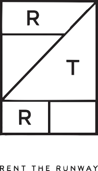

<#p align="center">
    
</#p>

## Overview
***

### Background
- Rent the Runway was offically founded in 2009, and now boasts over 9 million members.  According to their site, Rent the Runway was founded in order to bring empowerment and self-confidence to women around the world by providing an unlimited closet with which users can freely express themselves and dress for success.  Rent the Runway's shared closet means greater sustainability - 89% of users buy fewer clothes than they used to, and garments are used to the extent of their lifecycle, after which they may be donated to various organizations.  The company also launched their 'Rent the Runway Foundation' in 2015, whose mission is to encourage women in entrepreneurship.

### Data
- I found the initial dataset on Kaggle, which can be viewed [here](https://www.kaggle.com/rmisra/clothing-fit-dataset-for-size-recommendation).  The dataset includes __192,544__ total entries, with the following columns:
    - fit
    - user_id
    - bust size
    - item_id
    - weight
    - rating
    - rented for
    - review_text
    - body type
    - review_summary
    - category
    - height
    - size
    - age
    - review_date
- Each row corresponds with a user's review of their garment rental, with data gathered from 2011 to 2018, and includes their basic profile information.
