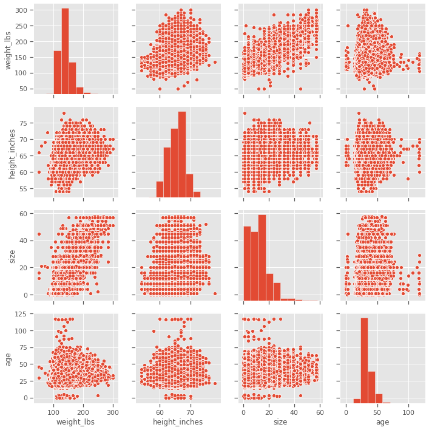
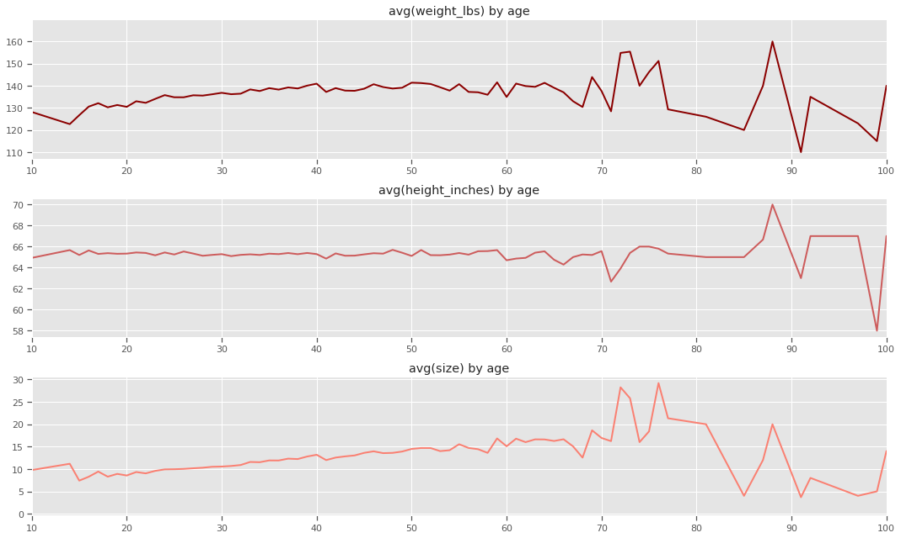
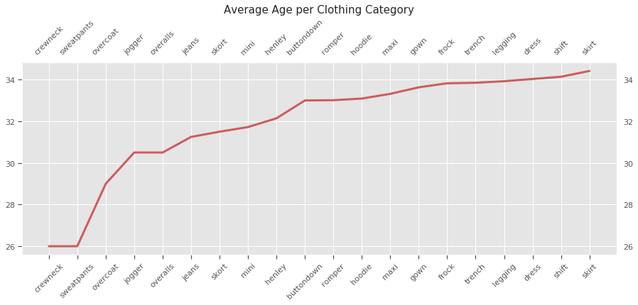
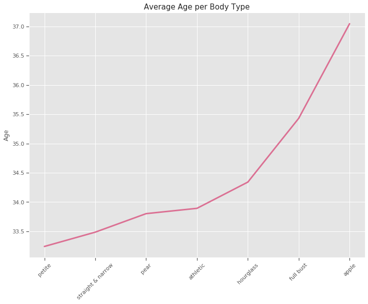
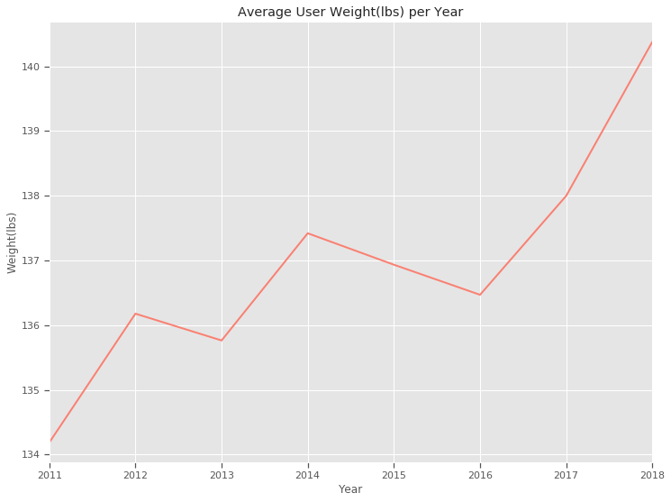
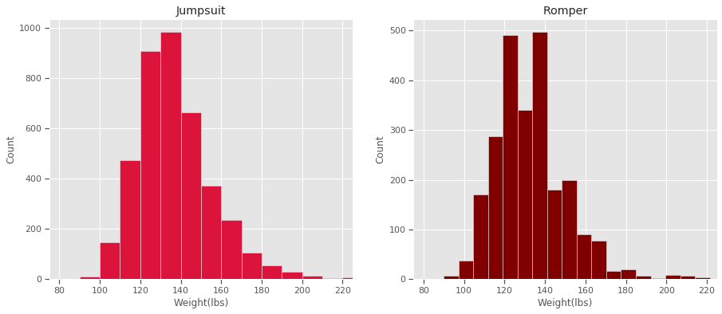
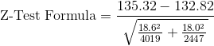

## Overview
***

### Background
- Rent the Runway was offically founded in 2009, and now boasts over 9 million members.  According to their site, Rent the Runway was founded in order to bring empowerment and self-confidence to women around the world by providing an unlimited closet with which users can freely express themselves and dress for success.  Rent the Runway's shared closet means greater sustainability - 89% of users buy fewer clothes than they used to, and garments are used to the extent of their lifecycle, after which they may be donated to various organizations.  The company also launched their 'Rent the Runway Foundation' in 2015, whose mission is to encourage women in entrepreneurship.

### Data
- I found the initial dataset on Kaggle, which can be viewed [here](https://www.kaggle.com/rmisra/clothing-fit-dataset-for-size-recommendation).  The dataset includes __192,544__ total entries, with the following columns:
    - fit
    - user_id
    - bust size
    - item_id
    - weight
    - rating
    - rented for
    - review_text
    - body type
    - review_summary
    - category
    - height
    - size
    - age
    - review_date
- Each row corresponds with a user's review of their garment rental, with data gathered from 2011 to 2018, and includes their basic profile information.

## Exploratory Data Analysis
***

### Cleaning the Data
- I initially split the data between rtr_data (the dataset excluding all null values) and rtr_nan_data (a new dataset with all the null values).
- I tidied both the rtr_data and rtr_nan_data by transforming data types in specific columns, specifically with 'weight', 'height', and 'review date', and correcting column names (replacing spaces with underscores; I didn't realize this issue immediately, and had to go back to fix it).
    - The weight and height columns presented their values as objects, e.g. '134lbs' and '5'4"'.  I changed these to numerical values, removed the punctuation, and converted the height values into inches.
    - The review_date column presented its values as objects as well, e.g. 'December 7, 2017', which I changed into datetime, shown as '2017-12-07'.  From there, I was able to pinpoint changes over time more simply through the numerical representations of both months and years.

### Null Values
- First, I needed to identify any null values and remove them (these were saved to a separate CSV file for further analysis).  The three columns with the most null values were 'bust size', 'weight', and 'body type', as seen below.  The total count came out to __46,163__ users, which makes up approximately __24%__ of the dataset.

- There could be various reasons users chose to leave these blank.  I had created my own account for research purposes and found myself pausing at the bust size and body type, as I didn't have an answer off the top of my head, and I wasn't immediately sure what each body type actually looked like.
 

- I then examined the null dataset, creating the below plot to get a general idea of its layout.  I wanted to see if there was any obvious reason a user may have chosen to omit their weight, bust size, and/or body type.  As someone who used to be heavy-set, I thought perhaps it was due to personal discomfort; entering a dress size seems less daunting than entering a weight value.  These relationships seem natural - for example, age and weight increase together, which makes sense if you consider something such as metabolism slowing with age.

- I looked into the top three null columns, and found that (with the exception of body type) the average user for null values was heavier compared to the non-null data (we will see this soon).  While there may multiple reasons for this, it does seem to match with my initial thoughts.

### Non-Null Values
- I started off simply in my exploration of the cleaned non-null data, taking a quick look into the numbers.  As you can see below, after removing the null values, we were left with __146,381__ rows.  And as I stated above, the mean weight - and dress size - is significantly lower in this dataset compared to the 'weight_lbs' and 'bust_size' columns in the null dataset.

 
 
- As in the null dataset, we can see below some natural correlations when comparing weight to the other columns within the non-null dataset.

- Moving forward, I wanted a visualization of data counts.   
    - The weight_lbs column skews to the right, which may suggest that the website has a higher count of plus-size users.  Ratings looks fine - I’m sure the company keeps a close eye on this column.  User heights vary quite a bit, which I hadn’t thought about.  The size column is interesting - users are either thin or plus-size, with few in the middle.  User ages lean more towards middle age, which I found surprising, as Rent the Runway looked like something that would cater towards younger users.  Finally we have the review_date column; this count climbs steadily over the years, so clearly Rent the Runway has had some success in their venture.

- I was drawn towards age and weight, and continued my exploratory analysis in those directions, with a brief look into age first.
    - Since weight and size generally go hand in hand, it’s no surprise how closely these graphs match.  As you can see, weight and size increase slightly until after age 60, where it starts to vary wildly.
    - Height doesn’t really change until after age 60, similar to weight and size.  I wonder what’s up with these users?

- I moved on to find out __which clothing categories were most popular for younger and older users.__  I thought perhaps older users would stick to traditional garments, whereas younger users would rent trendy clothes, and found this to be an overall valid theory.
    - There are 68 total categories, so I limited the outcome to the top 25 categories for the youngest and oldest ages.

- Next, I wanted to find similar data for __which 'rented_for' reason was most popular by age__.
    - This was neat!  I found that for approximately 25 & below, and 43 & above, 'formal affair' was the most common 'rented_for' reason.  Between those two groups, from about 26-39, 'wedding' was the most common.  I also noticed that as the age went up, I began to see the 'everyday' reason more often.  All in all, 'wedding' and 'formal affair' were the top two 'rented_for' reasons.
- Finally, since I’d seen previously that weight tended to increase with age, I wanted to know __whether the mean age per 'body_type' was of any significance.__  As we can see below, there is an unsurprising increase in mean age with larger body types.

- After I felt I'd sufficiently explored data relationships in terms of age, I switched over to weight. Here, I had a specific goal in mind: to see __whether the mean weight of users has significantly changed over time.__
    - It had; however, the mean user age per year went down from approximately 36 years to 34.5 years between 2011 and 2018.  I found this all incredibly interesting.  According to the CDC, the mean weight of American women from 1999-2016 has increased by approximately 7 lbs; I wonder if Rent the Runway updates their inventory to keep up with these changes?
    - After a quick look into their website, I found that while a user can update their profile to a dress size of up to 24, and can filter through garments, only about __4,357__ size 18+ garments are available for rental, while about __17,948__ garments in sizes 0-16 are available.  I browsed through a small number of garments I personally found stylish and none of them were available in plus sizes.  While I don’t know whether Rent the Runway is interested in expanding their inventory to include more options for plus-size users, I thought this built a good foundation for my hypothesis testing.

    
## Hypothesis Testing
***

### Hypothesis
- The mean weight for total users has increased by approximately 5 lbs from 2011 to 2018.  Rompers and jumpsuits have seen some general popularity in the past couple of years.  Suppose there's an opportunity to cater more towards users of a higher weight in an attempt to boost rentals, but a choice must be made - should a new line of rompers be rolled out, or a new line of jumpsuits?
    - Null Hypothesis: *There is no difference in mean weight between 'romper' and 'jumpsuit' categories rented*
    - Alt Hypothesis: *There is a difference in mean weight between 'romper' and 'jumpsuit' categories rented*

- Here's a brief look at the two categories:

- Jumpsuit data:
    - Count: 4,019
    - Mean: 135.32
    - Standard Deviation: 18.6
- Romper data:
    - Count: 2,447
    - Mean: 132.82
    - Standard Deviation: 18.0
    

    
- Z-test: 5.35
- P-value: 0.00000009

### Outcome
- We can see from the z-test and p-value that we would reject the null hypothesis, based on a significance threshold of 0.05.  Further inquiry suggests that we would meet the significance threshold if we subtracted 0.25 lbs from the mean difference while calculating the z-test (this would create a z-test value of 1.97 and a p-value of 0.05).  Such a small difference doesn't really matter in a business sense, but it's nice to know, and it does provide an answer we're looking for.
    - Therefore, I would suggest rolling out a new line of jumpsuits.
    - (•_•) ( •_•)>⌐■-■ (⌐■_■)
    
## Conclusion
***
- I would love to go further with this data and look into the review_text and review_summary columns to find out exactly what users are saying for different categories, etc, and how we can use this to bring more users to the website, and incorporate a fair amount of clothing options for all sizes.
- I discovered, after spending some more time navigating the Rent the Runway website after completing the above capstone, some interesting tidbits:
    - On their page about the Rent the Runway foundation, they have listed some alumni.  Among these women I found one specific person whose job is quite similar to the hypothesis test I created for this capstone.  Neat!
    - Rent the Runway is fairly expensive; I doubt I could've afforded the cheapest plan, at $\$$89 monthly, in my early 20s, which brings some clarity as to why the mean age of users is approximately 34.
    - A Huffington Post article referenced on the Rent the Runway website indirectly led me to another article, which in turn led me to a competitor called LOFT who offered a plan at 2/3 the price of Rent the Runway, and had many more options for plus-size users.  Looks like Rent the Runway is gonna have to step up their game!
    
In the spirit of competition, I'll link both websites below.
- Rent the Runway: https://www.renttherunway.com/
- LOFT: https://www.loft.com/

Enjoy!

- CDC source:  https://www.cdc.gov/nchs/data/nhsr/nhsr122-508.pdf
